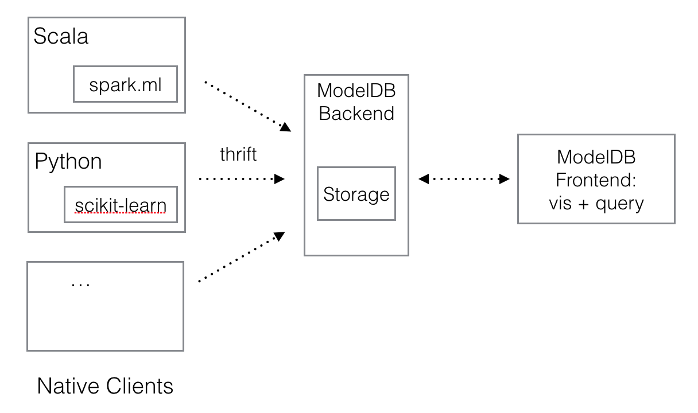

# ModelDB: A system to manage machine learning models

Companies often build hundreds of models a day (e.g., churn, recommendation, credit default). However, there is no practical way to manage all the models that are built over time.
This lack of tooling leads to insights being lost, resources wasted on re-generating old results, and difficulty collaborating.
ModelDB is an end-to-end system that tracks models as they are built, extracts and stores relevant metadata (e.g., hyperparameters, data sources) for models, and makes this data available for easy querying and visualization.

<!-- ## Why ModelDB?
 -->

## Use Cases
- Tracking Modeling Experiments
- Versioning Models
- Ensuring Reproducibility
- Visual exploration of models and results
- Collaboration

## How it works
1. Use a set of ModelDB native clients (currently ```spark.ml``` and ```scikit-learn```) to log modeling data to ModelDB.

  Using ModelDB requires minimal changes to a modeling workflow. For example, in ```spark.ml```, it requires the following changes:

  ```code
  estimator.fit(data) --> estimator.fitSync(data)

  transformer.transform(data) --> transformer.transformSync(data)
  
  model.predict(data) --> model.predictSync(data)
  ```
  And similarly in ```scikit-learn```:

  ```
  model.fit(data) --> model.fit_sync(data)
  preprocessor.transform(data) --> preprocessor.transform_sync(data)
  model.predict(data) --> model.predict_sync(data)
  ```

2. Explore models and related data through the frontend.

  Data logged through the ModelDB APIs gets stored in the ModelDB server. It can be queried via the ModelDB web frontend.

  

### Architecture
ModelDB adopts a modular client-server architecture (below). Native clients for different languages (and ML packages) log data to the ModelDB server. All communication takes place through the ModelDB Thrift API. As a result, adding a native client for another language is straightforward.
The web frontend surfaces data in the backend for query, visualization and updates.



## How to use?
Checkout the ModelDB Getting Started Guides for [spark.ml]() and [scikit-learn]() to start using ModelDB. Please use the ModelDB mailing list or Google Group for quesions.

## Papers
- [Short paper](papers/hilda_modeldb.pdf) at HILDA workshop, SIGMOD 2016
<!-- - [Harihar's Masters thesis]() on software design aspects of ModelDB -->
- Full paper (coming soon)

## Contributors
- [Manasi Vartak](http://people.csail.mit.edu/mvartak/), PhD Student, MIT CSAIL
- [Harihar Subramanyam](https://www.linkedin.com/in/harihar-subramanyam-0862b353/), MEng, MIT
- [Wei-En Lee](https://www.linkedin.com/in/weienlee/), MEng Student MIT
- [Srinidhi Viswanathan](https://www.linkedin.com/in/srinidhi-viswanathan-16b50b7b/), MEng, MIT
- [Samuel Madden](http://db.csail.mit.edu/madden/), Faculty, MIT CSAIL
- [Matei Zaharia](https://cs.stanford.edu/~matei), Faculty, Stanford University

## Contact us
Send questions to modeldb \_at\_ csail.mit.edu
